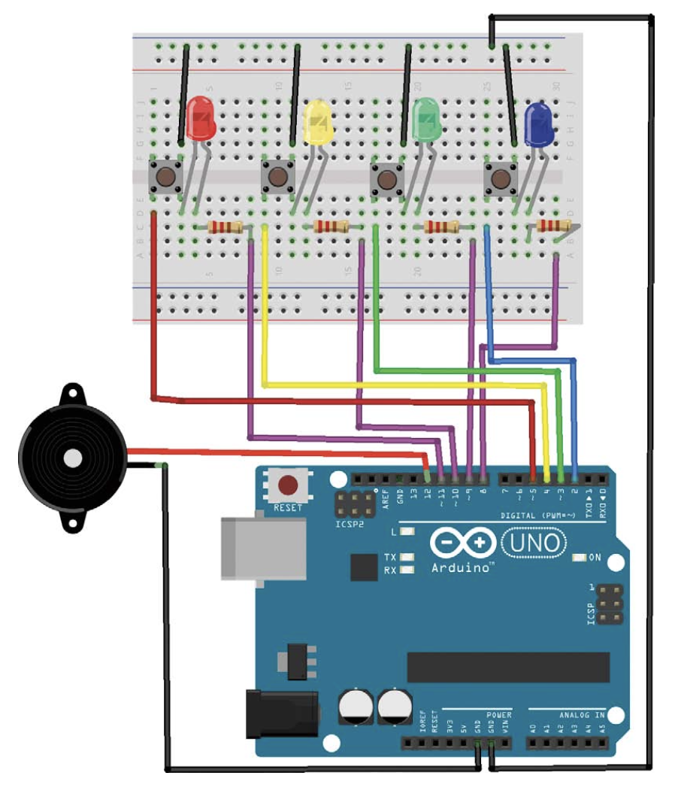

# Arduino Memory Game

## Table of Contents
- [Description](#description)
- [Features](#features)
- [Project Structure](#project-structure)
- [Hardware Setup](#hardware-setup)
- [Software Setup](#software-setup)
  - [Arduino Version](#arduino-version)
  - [Embedded C Version](#embedded-c-version)
- [Usage](#usage)
- [Demo](#demo)
- [License](#license)
- [Contributing](#contributing)
- [Contact](#contact)

## Description

Memory Game is an interactive game inspired by Simon Says, designed to test and improve your memory skills. It features two distinct versions: an **Arduino (.ino) version** and an **Embedded C version**. Players are challenged to replicate increasingly complex sequences of button presses and LED flashes, with auditory feedback provided through a piezo buzzer.

## Features

- **Dual Implementations**: Available in both Arduino (.ino) and Embedded C versions.
- **Responsive Gameplay**: Quick and accurate button press detection.
- **Dynamic LED Feedback**: LEDs flash in synchronization with game sequences and user inputs.
- **Auditory Feedback**: Unique melodies and tones enhance the gaming experience.
- **Milestone Celebrations**: Special tunes and LED patterns celebrate every five correct sequences.
- **Failure Handling**: Distinct failure tones and LED patterns indicate incorrect inputs and reset the game.

## Project Structure

```plaintext
.
├── LICENSE
├── Makefile
├── README.md
├── ino_version
│   └── ino_version.ino
└── src
    ├── config
    │   └── config.h
    ├── game
    │   ├── game_logic.c
    │   └── game_logic.h
    ├── hal
    │   ├── hal_adc.c
    │   ├── hal_adc.h
    │   ├── hal_delay.c
    │   ├── hal_delay.h
    │   ├── hal_gpio.c
    │   ├── hal_gpio.h
    │   ├── hal_pwm.c
    │   ├── hal_pwm.h
    │   ├── pin_mapping.c
    │   └── pin_mapping.h
    ├── input
    │   ├── input.c
    │   └── input.h
    ├── main.c
    ├── main.o
    ├── output
    │   ├── output.c
    │   └── output.h
    └── sound
        ├── melody.c
        ├── melody.h
        ├── notes.h
        ├── speaker.c
        └── speaker.h

9 directories, 28 files
```

## Hardware Setup



**Components Needed:**
- Arduino Uno
- 4 Pushbuttons
- 4 LEDs
- 4 Current-limiting resistors (220Ω recommended)
- Piezo Buzzer
- Breadboard and Jumper Wires

**Wiring Overview:**
1. **Buttons**: Connect each pushbutton between digital pins 2-5 and GND, with internal pull-up resistors enabled.
2. **LEDs**: Connect each LED's anode to digital pins 8-11 through a resistor and the cathode to GND.
3. **Speaker**: Connect the piezo buzzer to digital pin 12 and GND.

## Software Setup

### Arduino Version

1. **Requirements:**
   - [Arduino IDE](https://www.arduino.cc/en/software) installed on your computer.

2. **Setup Steps:**
   - Open the `ino_version.ino` file located in the `ino_version` directory using Arduino IDE.
   - Select the appropriate board and port from the `Tools` menu.
   - Click the **Upload** button to compile and upload the sketch to your Arduino Uno.

### Embedded C Version

1. **Requirements:**
   - [AVR GCC Toolchain](https://www.nongnu.org/avr-libc/user-manual/install_tools.html) installed.
   - `make` utility installed.
   - [AVRDUDE](http://www.nongnu.org/avrdude/) for uploading firmware.

2. **Setup Steps:**
   - Navigate to the project root directory in your terminal.
   - Run `make` to compile the Embedded C version.
   - Connect your Arduino Uno to the computer via USB.
   - Use `make upload` to upload the compiled firmware to the Arduino.

   **Note:** Ensure that the Makefile is configured correctly with your programmer settings.

## Usage

1. **Start the Game:**
   - Upon powering the device, the intro melody will play with corresponding LED blinks.
   - The game will display the first sequence.

2. **Gameplay:**
   - Repeat the sequence by pressing the corresponding buttons.
   - Each correct input will extend the sequence by one step.
   - Reach milestones every five correct sequences to hear celebratory melodies and LED patterns.

3. **Failure:**
   - Making an incorrect input will trigger a failure melody and reset the game.

## Demo

Watch the project in action!

[](https://www.youtube.com/watch?v=yrkbXQtZy78)

*Click the image above to view the demo video.*

## License

This project is licensed under the [MIT License](LICENSE).

## Contributing

Contributions are welcome! Please fork the repository and submit a pull request with your enhancements.

## Contact

For any questions or feedback, please contact:

**Ameed Othman**  
Email: othman.ameed@gmail.com
